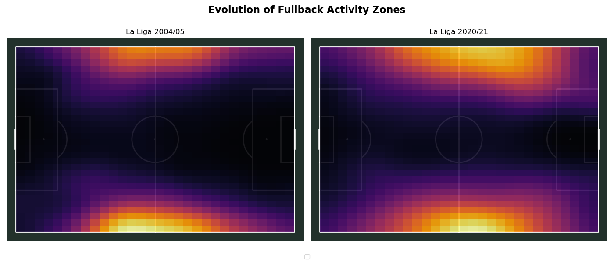
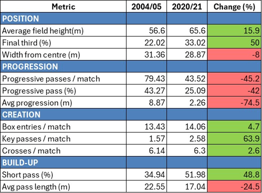

# How Fullbacks Changed: Less Progression, More Creation

## Overview

This project investigates how the role of fullbacks has evolved between the early 2000s and modern football. Using event data from La Liga, it compares the 2004/05 season with the 2020/21 season to quantify changes in positioning, progression, creation, and build-up behaviour.

---

## Key Insight

Modern fullbacks operate higher on the pitch, are less responsible for progressing the ball from deep areas, and contribute more to chance creation within structured possession systems.

---

## Visual Analysis

### Activity Zones (Heatmap)



The heatmaps highlight a clear positional shift. Fullbacks in 2020/21 operate significantly higher up the pitch, with increased presence in advanced areas compared to 2004/05.

---

### Quantitative Comparison



The table summarises the evolution across four dimensions: positioning, progression, creation, and build-up. It shows a consistent shift away from long-distance progression towards shorter passing and increased attacking contribution.

---

## Key Findings

### Positioning
- Final third involvement increased significantly (+50%)
- Average field height increased, indicating a more advanced starting position
- Slight reduction in width from centre, suggesting marginally more central involvement

### Progression
- Progressive passes per match decreased substantially (−45%)
- Average progression distance dropped sharply (−74%)
- Indicates reduced responsibility for advancing the ball from deeper areas

### Creation
- Key passes per match increased significantly (+63.9%)
- Cross volume remained broadly stable
- Suggests a shift toward chance creation rather than progression

### Build-Up
- Short passing increased (+48.8%)
- Average pass length decreased (−24.5%)
- Reflects a transition toward possession-based play

---

## Interpretation

The results point to a system-level reallocation of responsibilities rather than a simple positional shift.

While fullbacks in the modern game operate significantly higher on the pitch, their reduced progression volume and distance indicate that they are no longer primary agents of ball advancement from deeper zones. Instead, progression is increasingly initiated through central channels, with centre-backs and midfielders assuming greater responsibility in early build-up phases.

As a consequence, fullbacks are able to position themselves directly in advanced areas, where their actions are more closely linked to chance creation than to ball progression. Their increased presence in the final third, combined with a shift toward shorter passing, suggests a role focused on maintaining positional structure, supporting circulation, and facilitating final-third interactions.

This evolution is consistent with broader tactical developments in elite football, particularly the rise of positional play. Within these systems, player roles are defined less by traditional positional duties and more by their function within a coordinated structure, leading to a clearer separation between progression and creation phases of play.

---

## Methodology

- Data source: StatsBomb event data
- Competition: La Liga
- Seasons analysed: 2004/05 and 2020/21
- Positions: Left Back and Right Back
- Metrics grouped into four categories:
  - Positioning
  - Progression
  - Creation
  - Build-up
- All metrics normalised per match to ensure comparability

---

## Repository Structure

```
fullback-role-evolution/
│
├── analysis.py
├── requirements.txt
├── README.md
└── images/
    ├── heatmap.png
    └── table.png
```

---

## Future Work

- Extend the analysis to additional leagues and competitions
- Compare fullback roles across different tactical systems
- Analyse interaction between fullbacks and midfield progression
- Incorporate player-level and team-level comparisons
